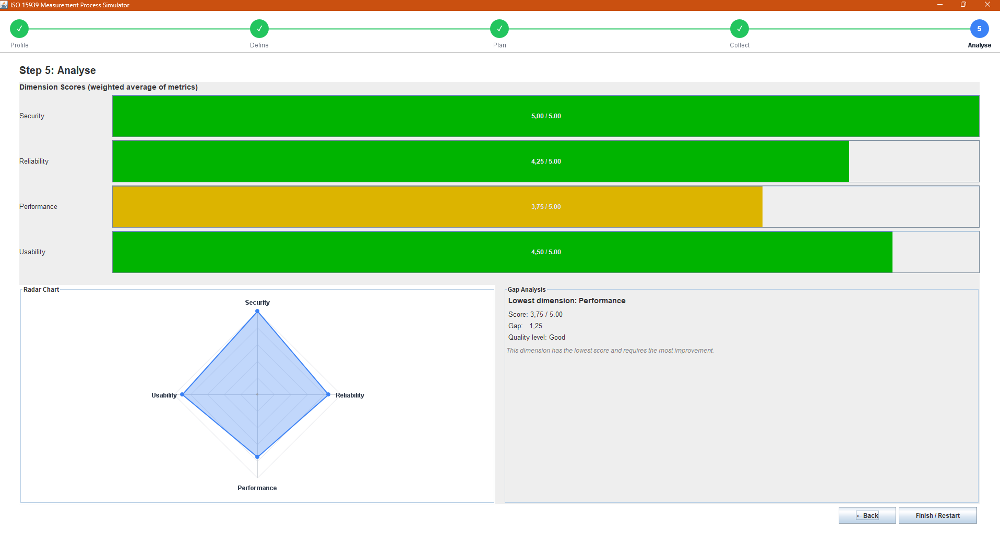

# ISO 15939 Measurement Process Simulator

**Student:** Bekir Kaan ÇALIŞKAN
**Student ID:** 202328018
**Course:** SENG 272 - Software Project II

---

## About

A Java Swing desktop application that simulates the 5 core steps of the
ISO/IEC 15939 software measurement process:

`Profile → Define → Plan → Collect → Analyse`

The user enters profile information, selects a quality scenario from a
predefined dataset (Health or Education mode), reviews the dimensions and
metrics, and finally analyses the results through dimension scores, a radar
chart and a gap analysis.

---

## Screenshot



---

## Requirements

- Java SE 17 or higher
- No external libraries (only standard Java SE)
- Tested on Windows 10/11

---

## How to compile

Open a terminal in the project root and run:

```bash
javac -d bin src/Main.java src/model/*.java src/controller/*.java src/view/*.java
```

This will compile all source files into the `bin/` directory.

---

## How to run

After compilation:

```bash
java -cp bin Main
```

The main window will open. Follow the wizard from Step 1 to Step 5.

---

## Project structure

```
src/
  Main.java                       (entry point)
  model/                          (data + business logic)
    QualityType.java, Mode.java, Metric.java,
    HigherIsBetterMetric.java, LowerIsBetterMetric.java,
    Dimension.java, Scenario.java, Session.java,
    ScenarioRepository.java
  controller/                     (wizard navigation)
    Navigator.java, WizardController.java
  view/                           (Swing panels)
    MainFrame.java, StepIndicator.java, WizardStep.java,
    ProfilePanel.java, DefinePanel.java, PlanPanel.java,
    CollectPanel.java, AnalysePanel.java, RadarChartPanel.java
docs/
  Requirement and Design.md       (design document + class diagram)
  screenshot.png                  (sample screenshot)
```

---

## Implemented features

- All 5 wizard steps with `CardLayout` based navigation
- Step indicator at the top with active / completed states
- Profile validation with user friendly warnings
- 2 modes (Health, Education) with 2 scenarios each
- Read only plan table per dimension
- Score calculation (rounded to 0.5, clamped 1.0 - 5.0)
- Color coded score cells in the collect step
- Weighted dimension averages with `JProgressBar`
- Gap analysis (lowest dimension, gap value, quality level)
- **Radar chart drawn with Java 2D Graphics (BONUS, +10%)**

---

## Note about Custom mode

The Custom mode is listed in the assignment description as a *Bonus
feature* but no specific points are given for it in the evaluation table.
For this reason I preferred to focus on the core 5 steps and the radar chart
bonus, which is explicitly worth +10%. The Custom mode is therefore left as
a placeholder in the scenario list.

---

## AI assistance

As required by the course rules, I declare that I received some AI
assistance during the development of this project. The help was limited to
specific technical parts:

- The Java 2D Graphics drawing for the radar chart (`RadarChartPanel`) and
  the custom step indicator (`StepIndicator`)
- The clean separation between view and controller layers
  (`WizardController`, `Navigator` and `WizardStep` interfaces)

The remaining parts (model classes, score calculation, validation logic,
wizard panels and scenario data) were written by me based on the assignment
requirements and Java Swing tutorials.
