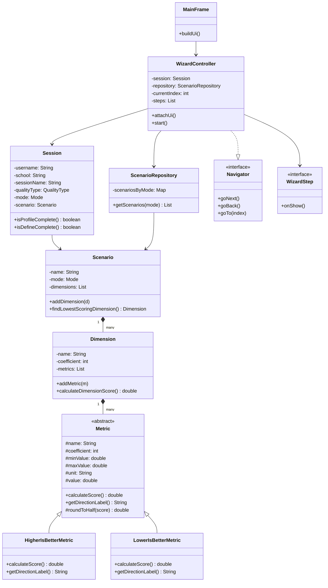

# ISO 15939 Measurement Process Simulator

## Requirements

- 5-step wizard application: Profile → Define → Plan → Collect → Analyse
- User information (username, school, session name) is collected in Step 1
- Quality type (Product/Process), mode (Health/Education) and scenario are selected in Step 2
- Dimensions and metrics of the selected scenario are shown as a read-only table in Step 3
- Raw values are displayed for each metric and a score between 1–5 is automatically calculated in Step 4
- Step 5 shows weighted averages per dimension, a radar chart and gap analysis
- At least 2 modes defined, each mode has at least 2 scenarios
- No external libraries — only standard Java SE library is used
- Must compile and run from command line using `javac` and `java`

---

## Design

### Architecture — MVC

```
model/       → data classes, score calculation logic, hard-coded scenario data
view/        → Swing panels, step indicator, radar chart
controller/  → wizard navigation, step transitions
```

### Package Structure

```
src/
├── Main.java
├── model/
│   ├── QualityType.java          (enum - Product / Process)
│   ├── Mode.java                 (enum - Custom / Health / Education)
│   ├── Metric.java               (abstract base class)
│   ├── HigherIsBetterMetric.java (score = 1 + formula)
│   ├── LowerIsBetterMetric.java  (score = 5 - formula)
│   ├── Dimension.java            (holds list of metrics)
│   ├── Scenario.java             (holds list of dimensions)
│   ├── Session.java              (stores user selections)
│   └── ScenarioRepository.java   (all hard-coded scenario data)
├── controller/
│   ├── Navigator.java            (interface)
│   └── WizardController.java     (implements Navigator)
└── view/
    ├── WizardStep.java           (interface - onShow())
    ├── MainFrame.java            (main JFrame)
    ├── StepIndicator.java        (top bar with step states)
    ├── ProfilePanel.java         (Step 1)
    ├── DefinePanel.java          (Step 2)
    ├── PlanPanel.java            (Step 3)
    ├── CollectPanel.java         (Step 4)
    ├── RadarChartPanel.java      (bonus - radar chart)
    └── AnalysePanel.java         (Step 5)
```

### Class Diagram



### OOP Principles Used

- **Inheritance:** `HigherIsBetterMetric` and `LowerIsBetterMetric` both extend abstract `Metric`
- **Polymorphism:** `calculateScore()` behaves differently depending on the metric type
- **Encapsulation:** All fields are private/protected, accessed through getters and setters
- **Interfaces:** `Navigator` (navigation contract), `WizardStep` (panel contract)

### Score Calculation Formula

```
Higher is better → score = 1 + (value − min) / (max − min) × 4
Lower is better  → score = 5 − (value − min) / (max − min) × 4
Result is clamped to [1.0 – 5.0] and rounded to nearest 0.5
```
